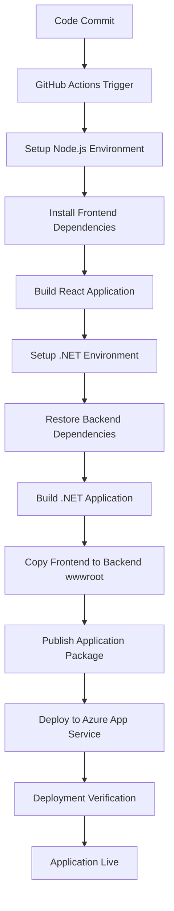

# DevOps Tasks Completed - Project Setup to Deployment

## 🔧 **Project Setup & Configuration**

• **Repository Structure Setup**
  - Created organized folder structure with frontend and backend separation
  - Configured Git repository with proper .gitignore files
  - Set up workspace configuration for development

• **Frontend Configuration**
  - Set up React application with Vite build tool
  - Configured Node.js environment (v18/v20)
  - Implemented responsive UI with modern design patterns
  - Set up npm package management and dependencies

• **Backend Configuration**
  - Created ASP.NET Core 8.0 Web API project
  - Implemented RESTful API architecture
  - Configured Entity Framework Core with MySQL
  - Set up JWT authentication and authorization

## 🗄️ **Database & Infrastructure**

• **Azure MySQL Database Setup**
  - Provisioned Azure Database for MySQL server (`lms-server.mysql.database.azure.com`)
  - Created database (`lms-database`) with proper user credentials
  - Configured connection strings for production environment
  - Set up database migrations and schema management

• **Azure App Service Configuration**
  - Created Azure App Service (`lms-cyf6d5f2fqhvf7b3.southindia-01.azurewebsites.net`)
  - Configured application settings and environment variables
  - Set up custom domain and SSL certificates
  - Configured resource scaling and performance monitoring

## 🚀 **CI/CD Pipeline Implementation**

• **GitHub Actions Workflow Setup**
  - Created automated deployment pipeline (`.github/workflows/azure-deploy.yml`)
  - Configured multi-stage build process (frontend → backend → deploy)
  - Set up branch-based deployment triggers (`main`, `deploy/usermanagement`)
  - Implemented manual deployment trigger option

• **Build Process Automation**
  - Automated Node.js dependency installation and frontend build
  - Configured Vite build optimization for production
  - Automated .NET Core dependency restoration and compilation
  - Set up automated testing integration (later removed for faster deployment)

• **Deployment Automation**
  - Integrated Azure Web Deploy with publish profiles
  - Configured static file serving for SPA (Single Page Application)
  - Set up automated package creation and deployment
  - Implemented deployment verification and health checks

## 🔐 **Security & Configuration Management**

• **Environment Configuration**
  - Set up development vs production environment configurations
  - Configured secure JWT secret key management
  - Implemented Azure App Service application settings
  - Set up CORS policies for cross-origin requests

• **Secrets Management**
  - Configured GitHub repository secrets for secure deployment
  - Set up Azure publish profile integration
  - Implemented secure database connection string management
  - Protected sensitive configuration from source control

## 📊 **Final Deployment Metrics**

• **Successful Deployment Achieved**
  - ✅ Live application: `https://lms-cyf6d5f2fqhvf7b3.southindia-01.azurewebsites.net`
  - ✅ Automated CI/CD pipeline with GitHub Actions
  - ✅ Secure Azure MySQL database integration
  - ✅ Full user authentication and management functionality
  - ✅ Responsive web application with modern UI/UX

## 🔄 **Continuous Integration/Continuous Deployment (CI/CD) Pipeline Flow**

